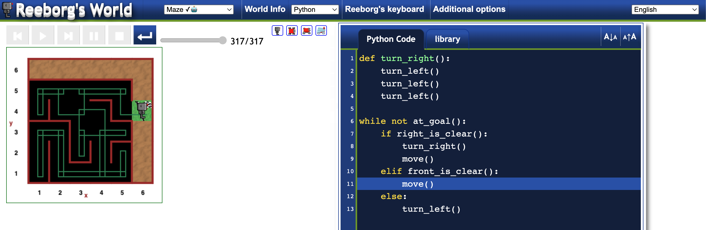

# Day 006 - Escaping the Maze

Task: Help a robot escape the maze using while loops.
Done on [Reeborg's World](https://reeborg.ca/reeborg.html?lang=en&mode=python&menu=worlds%2Fmenus%2Freeborg_intro_en.json&name=Maze&url=worlds%2Ftutorial_en%2Fmaze1.json)

Learning points:
- While loops