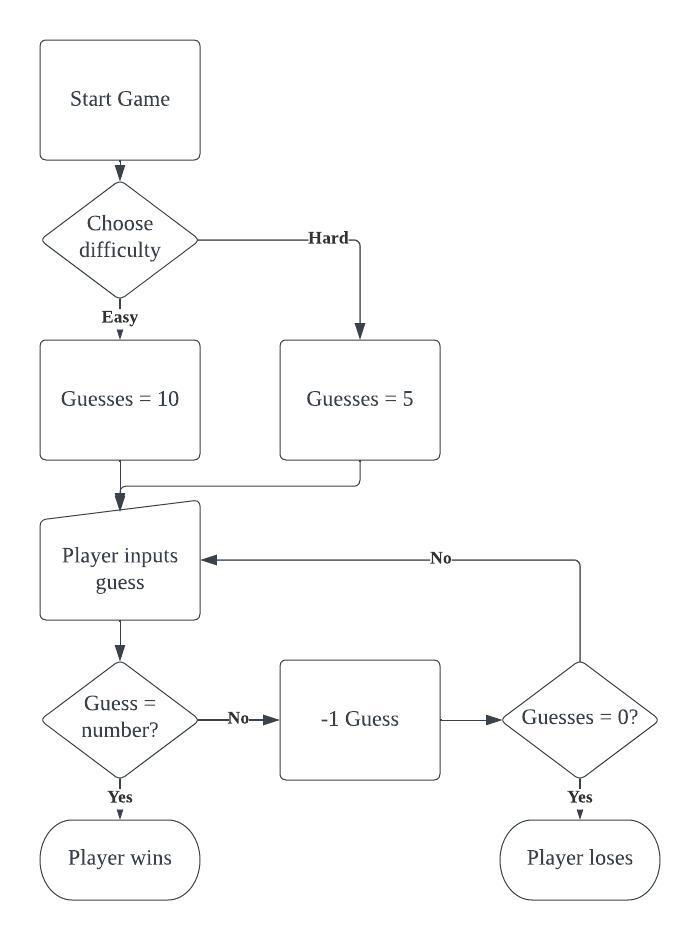

# Day 012 - Number Guessing Game

Task: Create a game where the player has to guess a number and is told whether their guess is higher or lower than the actual number. On easy difficulty, the player has 10 guesses. On hard difficulty, the player has 5 guesses.

### Process Flow

Learning points:
- Variable scope