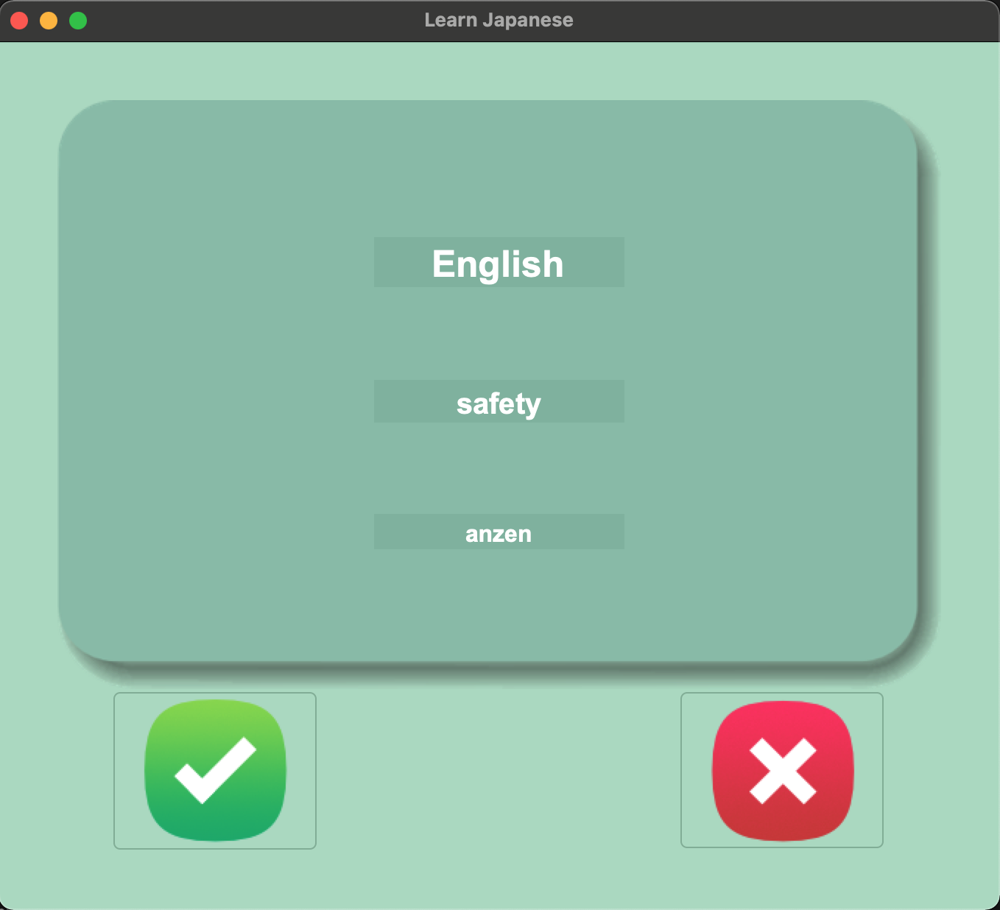

# Day 031 - Flash Card App 

Task: Create a flash card app for learning languages.

- Target language = Language user wants to learn
- Source language = Language user already knows
- Learning pile = Cards with words that user wants to learn
- Discard pile = Cards which user has already learned

### Project Requirements
- Show a series of flash cards to user 
- Show the target language on the front of a flash card
- The user needs to try to remember the meaning of the words in the source language
- If user clicks on the card, flip the card and show the word in both languages on the back
- The user can choose to keep the card for the next round, or remove the card from the learning pile

### Additional Requirements
- Change the target language from French to Japanese
- Add one more learning item: Romaji (romanised pronounciation of the Japanese words)
- Show romaji on the back of the card

## Screenshots

## Data Set

The data set used contains the top 2000 frequently used words in Japanese movie subtitles, compiled by [Hermit Dave](https://github.com/hermitdave/FrequencyWords/blob/master/content/2018/ja/ja_full.txt), with English names, punctuation and special characters removed.

The English translations were retrieved from the Google Translate API, and the Romaji transliterations were processed using the [Kuroshiro](https://github.com/hexenq/kuroshiro) library (NodeJS) in a separate script.

## Learning Points
- GUI with Tkinter
- Read/write from CSV
- Manipulate data with Pandas